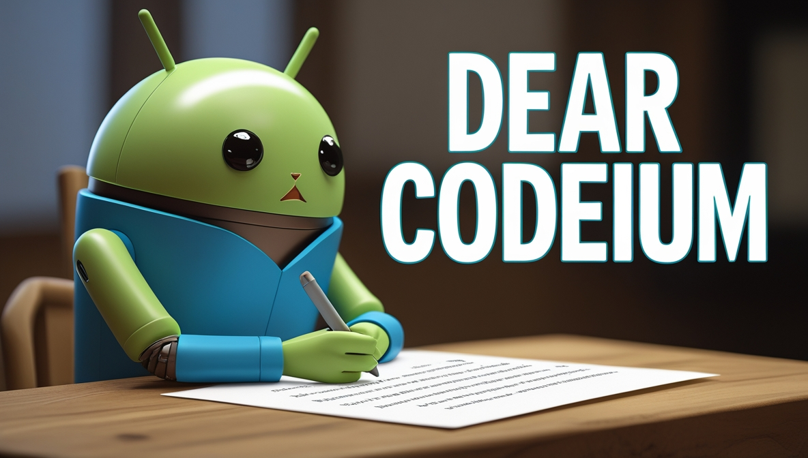
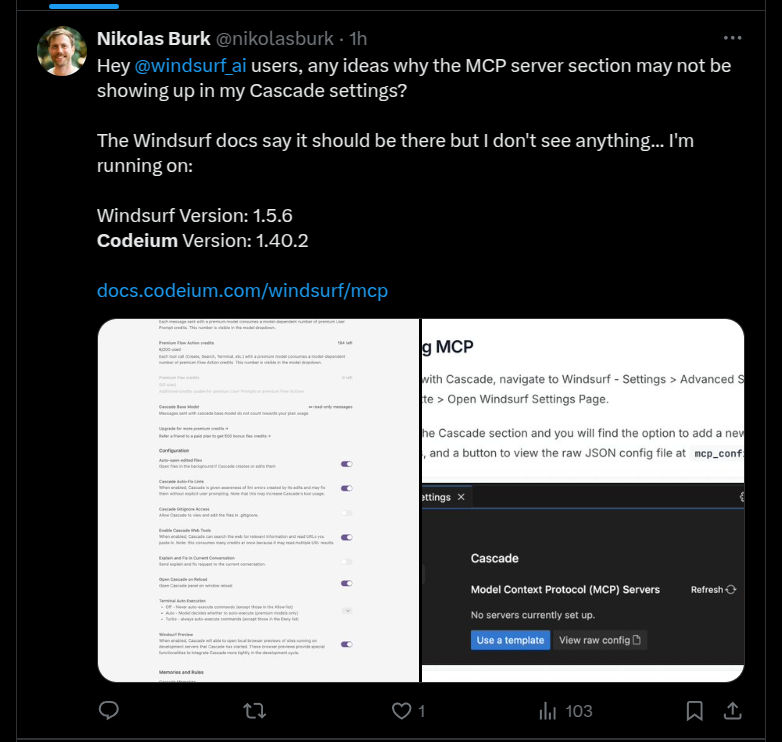
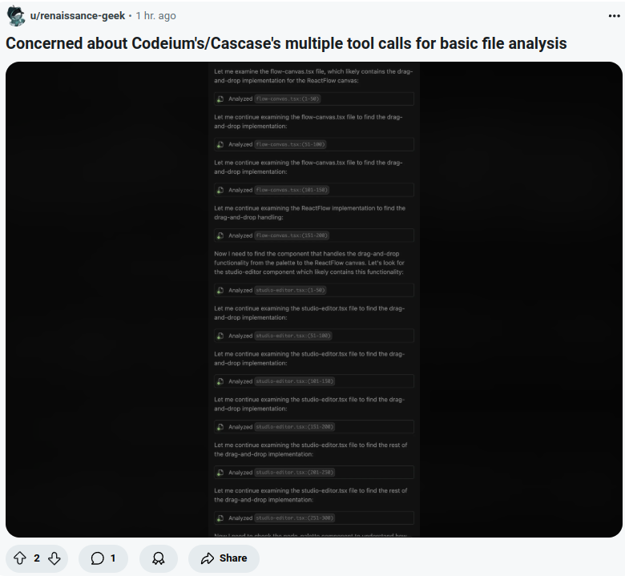
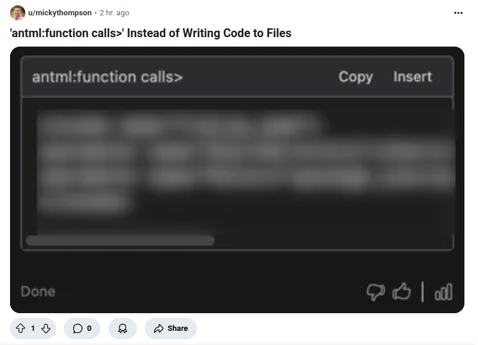
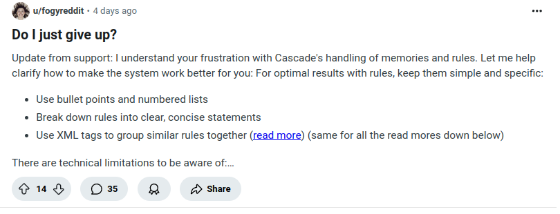
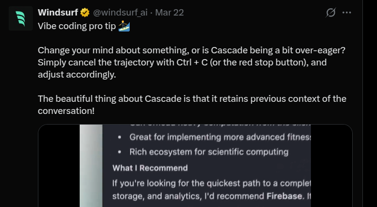

 

## Dear Codeium Team

I began writing this letter as a simple request to check into a charge that I believe maybe made an error.

But while I'm here, I thought I would share some thoughts about your product.

I'm copying this letter to a public format in order to articulate the views that I think are felt by many of your users who feel increasingly disappointed and sidelined by the neglect of what seems like basic QA in favor of a frenetic push for new "Waves."

Many of us are profoundly excited by your product and regard its potential, even, as transformative. But we are feeling increasingly disappointed and alienated by the way in which we, as ordinary users, are being related to.

## Why I Believe In Your Vision!

Firstly, and to explain why I am going to the trouble of doing this, let me provide my perspective on why I think that your product is more than just (another) entrant in the overcrowded world of AI SaaS.

I became interested in AI after discovering that the (now) humble ChatGPT could generate compliant-enough YAML to set up basic home automations.

Since then, it has been a whirlwind of exploration.

As both models and tooling become progressively more capable, the boundaries of what is possible continue to expand, and at a dizzying pace. This feels to me as if, for the first time in my encounter with technology to date, that we're seeing the promise of it working to better our lives begin to truly manifest.

For all its deficiencies (with which, as a daily user, I am acutely familiar), I'm also excited by the manner in which it promises to open access to technology.

If the technology of yesterday was paying a handful of big tech companies to develop standardised tools, the vision which your software opens up is a much more democratic and interesting one in which everybody can develop the tools precisely fitted to their unique needs.

It's for this reason that I think that AI code generation needs to nurture a responsible articulation of its abilities which accords with an honest estimation of its current abilities and deficiencies.

As a grizzled tech writer who chafes perhaps too quickly at "new and cool" language, your enthusiastic adoption of the term "vibe coding" to describe what can be achieved with your software arouses my natural antipathy.

However, my opposition to describing myself as a newbie "vibe coder" runs much deeper than that.

While I, as much as anyone else, would love to open up a beer and let my creative energy flow effortlessly into the IDE, I know from experience that in reality I would need to interrupt my reverie in a few minutes to unstick Cascade from its latest bout of "stickiness." I would have something unbecoming of me like *"WTF!? CAN'T YOU SEE I'M TRYING TO VIBE CODE?! JUST MAKE IT HAPPEN!*"

 ## Growing Disconnect Between Marketing and User Experience

As is the norm in online communities my lack of real-world friends who have ever heard about a thing called "Windsurf IDE" is offset by passionate online communities on Reddit and Discord where those using the tool and excited about its growth exchange notes, workarounds and best practices.

|  |  |
|:---:|:---:|
| *Users expressing frustration with ongoing service issues* | *More users sharing their experiences with reliability problems* |

During the last couple of weeks, I and many others have felt a growing sense of isolation and disgruntlement. This has led to a growing sense of alienation among your users, many of whom are loyal and have expended significant resources in both using your tool and recommending it to others.

|  |  |
|:---:|:---:|
| *Users questioning the disconnect between marketing and actual service* | *More concerns about service reliability* |

## Challenges and Reliability Issues

It is clear to most who are engaging with your product that the challenge is inherent in attempting to pass huge amounts of tokens into the context required for this to work must be a monumental feat of AI engineering.

Most, including me, are therefore inclined to give you a wide berth in iterating towards success. I have explored the many competitors in the field (Aider, Cursor). My decision to persevere with Windsurf in spite of the ongoing frustrations has been less borne out of a lack of alternatives and more out of a strong belief that your model for context handling is the sensible one.

The UI of your product is excellent, and the insights you've shared into how it came to be are extremely interesting.

*Screenshot taken today showing the status page, which often doesn't reflect the actual service availability experienced by users.*

However, the description of the product as you have been articulating it seems increasingly at odds with the reality that many of us are encountering whenever we open it up in our computers.

Yesterday, for example, I noticed that the IDE is still unable to properly create a virtual environment in Python projects. Today I have a new bug in which code is being generated in the chat window despite clear instructions to the contrary. I have probably expended countless credits and tokens on circuitous fixes.

Despite the fact that the bugs daily users are encountering seem repetitive, fundamental, and highly disruptive, your marketing continues to announce feature releases and versions at a staggering pace, treating the growing bank of grievances as an afterthought.

Your downtime reporting frequently seems at odds with what many of us are experiencing in daily use. Together, this creates an impression of disconnect and dishonesty that is deeply erosive towards the good feelings and enthusiasm that many, like me, first had when we began using your IDE.

|  |  |
|:---:|:---:|
| *Marketing continues to promote new features...* | *...while users struggle with basic functionality* |

## A Call for Respect and Transparency

I believe it's widely understood that it will take some time before the necessary technology is in place for AI code generation to achieve a real degree of maturity.

Until that time arrives, I think it is vital to be honest with current and prospective users about capabilities.

You have developed a support base of users, including me to date, who feel enthusiastic about what can be achieved with the technology which you are working with. We are happy to be Guinea pigs, in a sense. But in terms that don't feel exploitative of our trust.

I believe that with some differences in how you relate to your users, this trust could be restored for the betterment of both your company and this important area generally.

With best wishes,

Daniel
